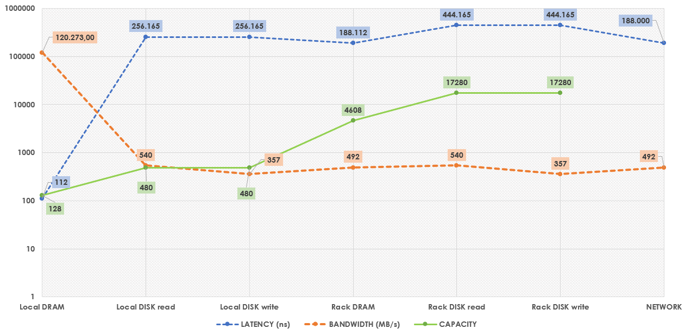

## Server Specifications

- 144 nodes (AMD EPYC Rome, 16 core, 2 disk, 25Gb Ethernet)
- CPU 16-core AMD 7302P at 3.00GHz (x86_64)
- RAM 128GB ECC Memory (8x 16 GB 3200MT/s RDIMMs)
- Disk Two 480 GB 6G SATA SSD (Micron 5200)
- NIC Two dual-port Mellanox ConnectX-5 25Gb GB NIC (PCIe v4.0) (two ports available for experiment use)

> The PowerEdge c6525 server has a 2U form factor, so a 4 x 72U rack configuration was assumed for the capacity calculations (36 servers in each rack).

  

## Chart

 

## Comments and Observations

- Local DRAM latency is several orders of magnitude smaller than all other latencies measured.
   
- Access to Rack DRAM is faster `(188 us)` than access to Local Disk `(256 us)`.
   
- Network BW `(492 MB/s)` is higher than Disk write BW `(357 MB/s)`, therefore in this particular cluster the Disk is the bottleneck when it comes to remote disk accesses (for write operations).
   
- This also means that accesses to another server’s DRAM will also have a higher BW `(492 MB/s)` than that of the Local Disk (for write operations).

 
 
